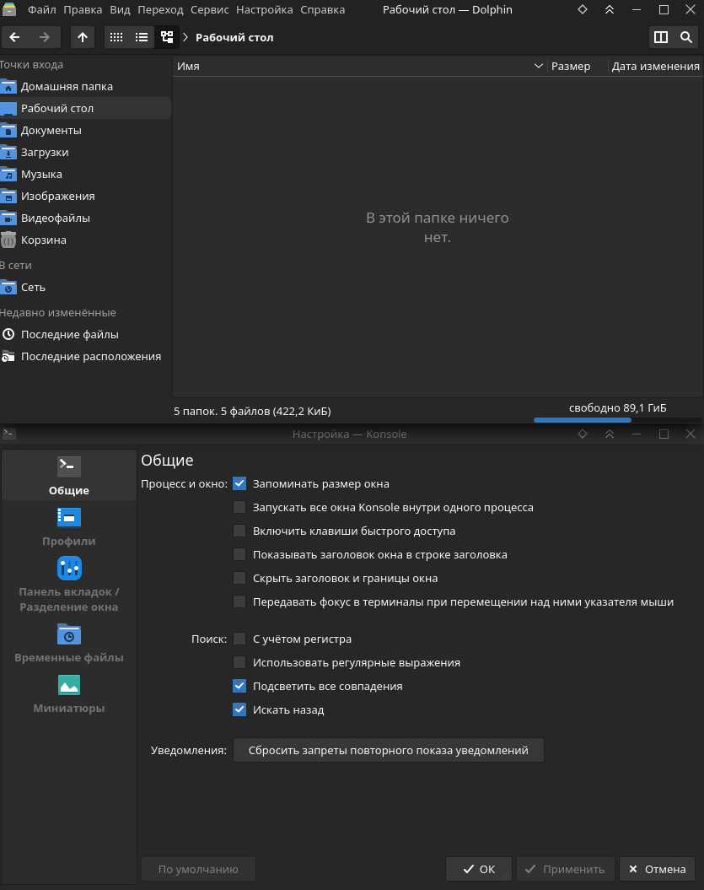

# YaruFlat
Fork from KYaru Kvantum theme by [antosalvatore](https://github.com/AntoSalvatore/KYaru) for KDE Plasma

Changes:
* Default color is blue insted of orange and purple (for color-schemes and for Kvantum SVG)
* Push icons and menu icons are enabled by default
* Ignore inactive state is enabled by default
* Kvantum SVG theme now uses checkboxes from [Materia KDE](https://github.com/PapirusDevelopmentTeam/materia-kde) theme

<table>
  <tr>
    <td> </td>
    <td></td>
   </tr> 
</table>
